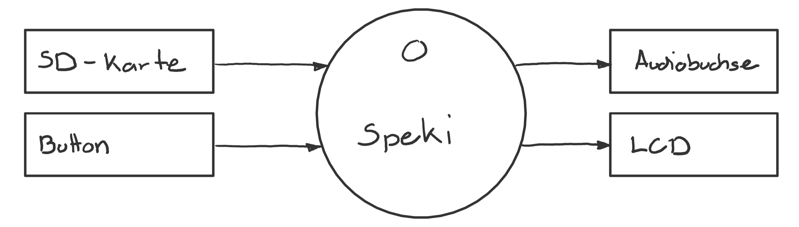
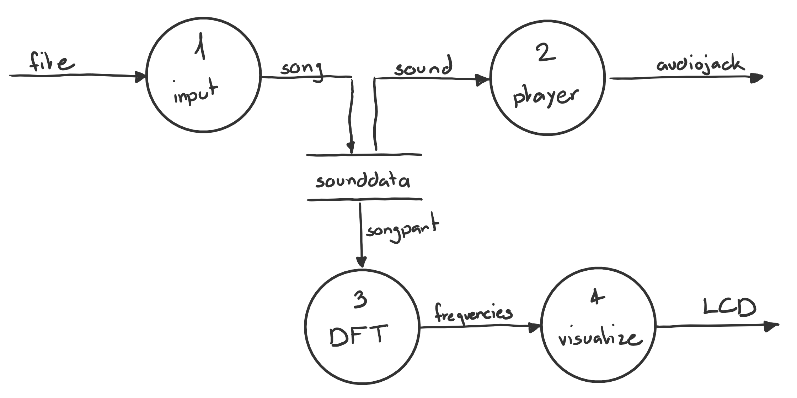
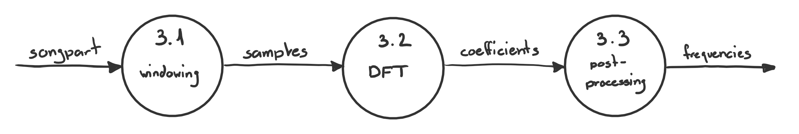

# DFD - Data Flow Diagram

Dieses DFD beschreibt die Quellen und Senken von Daten, Datenflüsse sowie die datenverarbeitenden Module.

## Kontext

@image latex doc/DFD/dfd-kontext.png Kontext

## Level 0

@image latex doc/DFD/dfd-level-0.png Level 0

## FFT

@image latex doc/DFD/dfd-dft-3.png FFT-3

